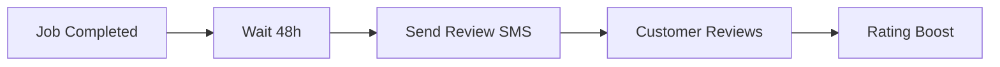

## Overview

EzBiz Services automates your front office with features like missed call text-backs, AI receptionists, appointment reminders, follow-up sequences, and review requests. These tools handle customer interactions 24/7, so you focus on jobs. Set them up in your dashboard at `https://dashboard.example.com`.

<Callout kind="tip">
Review these features in your EzBiz dashboard. Customize messages and triggers to match your service business.
</Callout>

## Key Features

<Columns cols={3}>
  <Card title="Missed Call Text-Back" icon="phone" href="#missed-call-text-back">
    Send instant SMS to unanswered callers. Prevent leads from slipping away.
  </Card>
  <Card title="AI Receptionist" icon="bot" href="#ai-receptionist">
    Handle calls with intelligent responses and scheduling.
  </Card>
  <Card title="Appointment Reminders" icon="calendar" href="#appointment-reminders">
    Reduce no-shows with automated SMS notifications.
  </Card>
  <Card title="Follow-up Sequences" icon="message-circle" href="#follow-up">
    Nurture leads with timed SMS campaigns.
  </Card>
  <Card title="Review Requests" icon="star" href="#reviews">
    Boost ratings by automating post-job review links.
  </Card>
</Columns>

## Missed Call Text-Back Setup

Configure text-backs to respond instantly to unanswered calls.

<Steps>
  <Step title="Enable Feature" icon="toggle-right">
    Go to `https://dashboard.example.com/settings/calls` and toggle "Missed Call Text-Back" on.
  </Step>
  <Step title="Customize Message" icon="edit-3">
    Edit the default SMS: `Sorry we missed you! We'll call back soon. Reply YES for a callback.`
  </Step>
  <Step title="Test It" icon="play">
    Call your business number from a test phone and verify the SMS arrives.
  </Step>
</Steps>

## AI Receptionist Configuration

Set up your AI to answer calls, qualify leads, and book appointments. Use tabs for common scenarios.

<Tabs>
  <Tab title="Basic Greeting" icon="phone">
    Configure a simple welcome message.

````javascript
{
  "greeting": "Thanks for calling EzBiz Plumbing. How can I help?",
  "options": ["Book appointment", "Get quote", "Leave message"]
}
````
  </Tab>
  <Tab title="Scheduling Integration" icon="calendar">
    Link to your calendar.

    <Callout kind="info">
      Connect Google Calendar or your CRM first.
    </Callout>

````javascript
{
  "calendar": "google",
  "availability": "next 7 days",
  "confirm": "SMS reminder sent"
}
````
  </Tab>
</Tabs>

## Appointment Reminders and Booking

Automate reminders to cut no-shows by up to 50%.

<CodeGroup tabs="Dashboard,API">
```javascript
// Dashboard config example
POST https://api.example.com/v1/reminders
{
  "template": "Reminder: Your appointment with EzBiz is tomorrow at 2PM. Reply CANCEL to reschedule.",
  "offset": "24 hours"
}
```

```bash
# API setup via cURL
curl -X POST https://api.example.com/v1/reminders \
  -H "Authorization: Bearer YOUR_API_KEY" \
  -d '{"template": "Your booking confirmation...", "offset": "1 hour"}'
```
</CodeGroup>

## Follow-up SMS Sequences

Create automated sequences for post-job follow-ups.

<Expandable title="Advanced Sequence Builder" default-open="false">
Use the dashboard sequence editor:

1. Trigger: Job completed
2. Day 1: `Great job today! Any issues?`
3. Day 3: `Ready for your next service? Book here: https://ezbizservices.com/book`

<ParamField path="sequence_id" param-type="string" required="true">
  Unique ID for the sequence.
</ParamField>

<ParamField body="delay_hours" param-type="number" required="false">
  Hours before next message (default: 24).
</ParamField>
</Expandable>

## Review Request Automation

Prompt happy customers for Google or Yelp reviews automatically.

<Steps>
  <Step title="Set Trigger" icon="star">
    In `https://dashboard.example.com/reviews`, select "Job completed > 48 hours".
  </Step>
  <Step title="Add Review Link" icon="link">
    Paste your Google review URL: `https://g.page/r/your-review-link`.
  </Step>
  <Step title="Monitor Results" icon="bar-chart-3">
    Track review rates in the reporting dashboard.
  </Step>
</Steps>



## Next Steps

<Columns cols={2}>
  <Card title="Integrations" icon="plug" href="/authentication">
    Connect your CRM or calendar.
  </Card>
  <Card title="Reporting" icon="bar-chart" href="/quickstart">
    View call and conversion analytics.
  </Card>
</Columns>

<Callout kind="success">
Your front office is now automated. Monitor performance and tweak automations as needed.
</Callout>