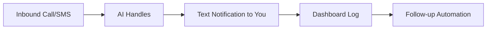

## Prerequisites

Before starting, ensure you have:

<Callout kind="info" title="What you'll need">
- A service business phone number (US/Canada supported)
- Access to your phone carrier account for porting or forwarding
- Stripe account for billing (optional during trial)
- Demo line ready for testing: <kbd>(601) 552-5990</kbd>
</Callout>

## Sign Up and Verify Your Account

Complete setup in minutes via the dashboard.

<Steps>
  <Step title="Create Account" icon="user-plus">
    Visit `https://dashboard.ezbizservices.com/signup` and enter your business email, name, and phone number.
    
    Select your service type (e.g., plumbing, HVAC, landscaping).
  </Step>
  
  <Step title="Verify Business Details" icon="check-circle">
    Upload proof of business: EIN, business license, or website URL.
    
    Confirm service area and hours. Approval takes `{<5}` minutes.
  </Step>
  
  <Step title="Connect Phone and SMS" icon="phone">
    Forward your number to EzBiz:
    
    ```
    Current Number → dashboard.ezbizservices.com/forwarding
    ```
    
    Or port your number (takes `{24}` hours).
    
    Enable SMS via Twilio integration (API key from Twilio dashboard).
  </Step>
</Steps>

## Test Call Handling

Verify everything works before going live.

<Tabs>
  <Tab title="Inbound Call Test" icon="phone-incoming">
    Call your forwarded number from a test phone.
    
    Expect:
    
    1. AI greeting: "Thanks for calling [Your Business]. How can I help?"
    2. SMS notification to you with caller details.
    
    <Request tabs="cURL" show-lines="true">
    ```bash
    curl -X POST https://api.ezbizservices.com/v1/test-call \
      -H "Authorization: Bearer YOUR_API_KEY" \
      -d '{"phone": "+15551234567", "script": "default_greeting"}'
    ```
    </Request>
  </Tab>
  
  <Tab title="SMS Text-Back Test" icon="message-circle">
    Text your number: "Schedule appointment".
    
    AI responds instantly and notifies you via SMS.
    
    <Callout kind="success">
      Green light: You'll receive full transcript in dashboard.
    </Callout>
  </Tab>
</Tabs>



## Launch and Go Live

Your system activates in `{24}` hours max—no contracts.

<Response show-lines="false">
```json
{
  "status": "live",
  "forwarding_number": "+1-XXX-XXX-XXXX",
  "features": ["text-back", "scheduling", "reminders"]
}
```
</Response>

<Columns cols={3}>
  <Card title="Configure Automations" icon="settings" href="/configuration">
    Set up scheduling, reviews, and reports.
  </Card>
  
  <Card title="Authentication & API" icon="key" href="/authentication">
    Secure API access for custom integrations.
  </Card>
  
  <Card title="Monitor Dashboard" icon="bar-chart-3" href="https://dashboard.ezbizservices.com">
    Real-time calls, leads, and revenue tracking.
  </Card>
</Columns>

<Callout kind="tip" title="Next Action">
Review missed calls in your dashboard and tweak the AI script. Expect `{62%}` fewer lost leads immediately.
</Callout>